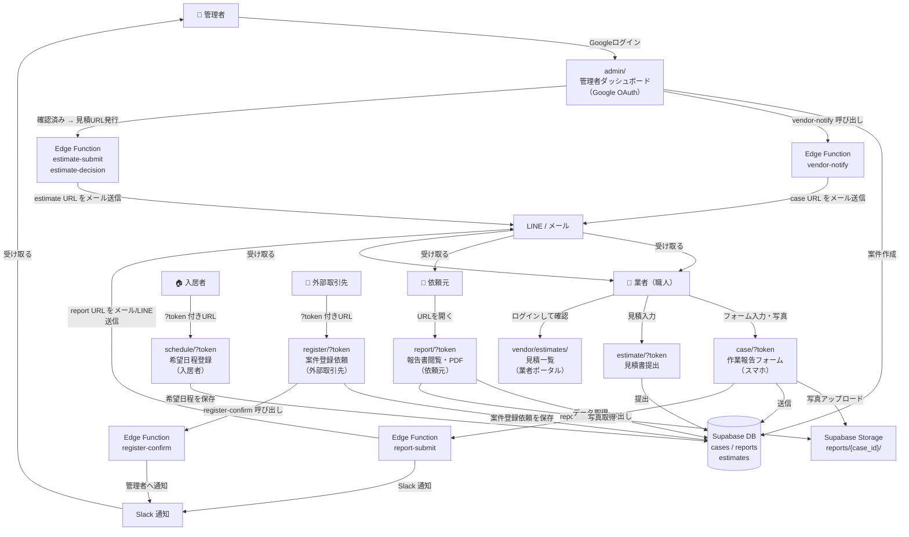

# URL 連携マップ

最終更新: 2026-05-21

---

## 全体フロー図



---

## URL 一覧

| URL | 対象 | 認証 | 役割 |
|-----|------|------|------|
| `admin/` | 管理者 | Google OAuth | 案件管理・全機能 |
| `case/?token=xxx` | 業者 | URLトークン | 作業報告フォーム |
| `report/?token=xxx` | 依頼元 | URLトークン | 報告書閲覧・PDF出力 |
| `estimate/?token=xxx` | 業者 | URLトークン | 見積書提出 |
| `vendor/estimates/` | 業者 | メール/パスワード | 自社見積一覧 |
| `register/?token=xxx` | 外部取引先 | URLトークン（存在確認のみ） | 案件登録依頼 |
| `schedule/?token=xxx` | 入居者 | URLトークン | 希望日程登録 |

---

## トークンの流れ

```
cases.access_token（UUID v4）
  │
  ├─ case/?token=     ← 業者が作業報告に使う
  ├─ estimate/?token= ← 業者が見積提出に使う
  └─ report/?token=   ← 依頼元が報告書閲覧に使う

同一 token で 3つの URL を共有。
admin/ から各URLを発行・コピー・通知できる。
```

---

## ステータス遷移

```
pending（未着手）
  └─ 業者が case/ で報告送信
       ↓
submitted（提出済）
  └─ 管理者が admin/ で確認済みにする
       ↓
reviewed（確認済）
```
