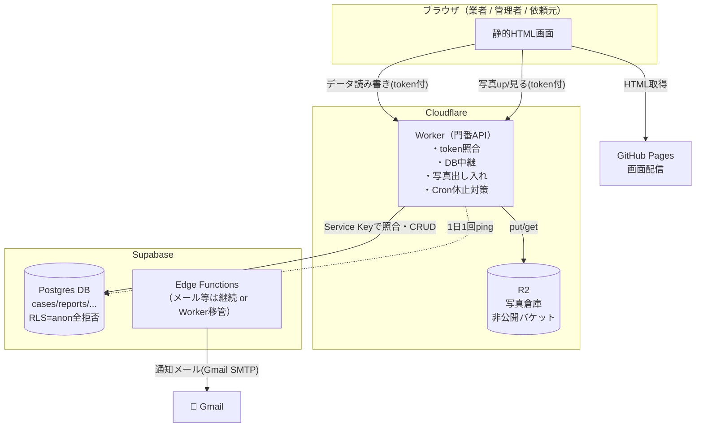
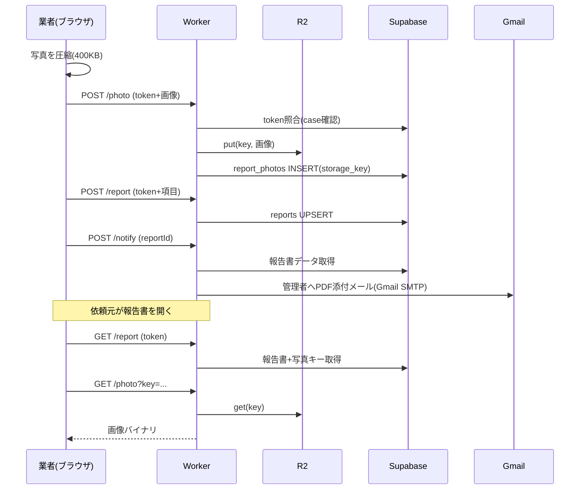

# Cloudflare 移行設計書（ワイヤーフレーム＋定義書）

最終更新: 2026-06-01
対象: 施工・漏水調査 報告管理システム

> 目的：① 写真の容量上限を解消（6000件/年に耐える）、② セキュリティ穴（公開キーで全件閲覧可能）を根絶、③ メールを無料化。
> 方針：**Supabaseは捨てない**（無料DBとして継続）。Cloudflareを「前面の門番＋写真倉庫」として足す。

---

## 1. 課題（なぜ作り直すか）

| # | 現状の問題 | 原因 | 本設計での解決 |
|---|---|---|---|
| 1 | 誰でも全案件・全業者メールを閲覧可能 | 公開HTMLに匿名キー＋RLSが `USING(true)` | Worker門番＋RLS全拒否でキーを非公開化 |
| 2 | 写真がSupabase Storage 1GBで頭打ち | 1件20MB×多数で即満杯 | R2へ移送（10GB無料、超過$0.015/GB、転送無料） |
| 3 | メール送信が独自ドメイン必要/上限 | Resend依存 | Gmail SMTP（実装済み）/ 将来Worker経由も可 |
| 4 | 無活動1週間でSupabase休止 | 無料枠仕様 | Worker Cronで1日1回ping |

---

## 2. 全体アーキテクチャ



**最重要原則：ブラウザはSupabaseを直接叩かない。全リクエストはWorkerを通す。**
公開HTMLからキーが消え、token無し/他人tokenの直叩きは何も返らない。

---

## 3. 画面ワイヤーフレーム（変更点のみ）

画面の見た目・項目は現状維持。**変わるのは「データの取得先」だけ**（Supabase直叩き → Worker経由）。

### W-2 業者 作業報告フォーム（case/?token）

```
┌─────────────────────────────┐
│ 作業報告フォーム              │
│─────────────────────────────│
│ 物件: ○○マンション 101       │  ← Worker GET /case で取得
│                             │
│ [写真を追加] 📷              │  ← 選択時にブラウザで圧縮(400KB)
│  ┌───┐┌───┐┌───┐           │     → Worker POST /photo へ
│  │📷 ││📷 ││ + │           │     → R2保存・キーをDB記録
│  └───┘└───┘└───┘           │
│ コメント: [床下     ▼]       │
│                             │
│ 原因: ○給湯管 ○排水管 ...    │
│ 方針: ○開口調査必要 ...      │
│                             │
│        [送信する]            │  ← Worker POST /report
└─────────────────────────────┘
```
変更点：写真アップは **圧縮 → Worker /photo → R2**。データ送信は **Worker /report**。

### W-3 報告書 閲覧・PDF（report/?token）

```
┌─────────────────────────────┐
│ 作業完了報告書                │
│─────────────────────────────│
│ 物件 / 作業日 / 業者          │  ← Worker GET /report
│ ┌─────────────────────────┐ │
│ │ 対応前  対応中  対応後    │ │  ← 各写真は Worker GET /photo?key=
│ │ [📷]   [📷]    [📷]      │ │     (R2から非公開取り出し)
│ └─────────────────────────┘ │
│ トラブル報告（赤帯）          │
│        [PDF出力]             │
└─────────────────────────────┘
```

### W-1 管理者ダッシュボード（admin/）

```
┌──────────────────────────────────────┐
│ 報告管理システム   [+新規]  [ログアウト] │
│──────────────────────────────────────│
│ [全] [未着手] [提出済] [確認済]         │  ← Worker GET /cases (管理者は要ログイン)
│ ┌──────────────────────────────────┐ │
│ │ 260531-101 ○○101 提出済 [URL発行]│ │
│ └──────────────────────────────────┘ │
└──────────────────────────────────────┘
```
管理者だけは「全件閲覧」が必要 → Workerが**管理者セッション（OAuth）を検証**したときのみ全件返す。

---

## 4. Worker API 定義

ベースURL（例）: `https://report-api.<account>.workers.dev`
全リクエストに `token`（業者/依頼元用）または 管理者セッションが必要。

### 4-1. 認証方式

| 利用者 | 認証 | Workerでの検証 |
|---|---|---|
| 業者・依頼元・入居者・取引先 | URL token（UUID） | `cases.access_token = token` を照合し、該当caseのみ許可 |
| 管理者 | Google OAuth（admin/） | セッションJWTを検証 → 全件許可 |

### 4-2. エンドポイント一覧

| メソッド | パス | 用途 | 認証 | 主パラメータ |
|---|---|---|---|---|
| GET | `/case` | 案件1件取得（フォーム表示用） | token | `token` |
| POST | `/report` | 報告書の作成/更新（autosave含む） | token | `token`, body=report項目 |
| POST | `/photo` | 写真1枚アップロード | token | `token`, `case_id`, `phase`, file |
| GET | `/photo` | 写真1枚取得（画像バイナリ返却） | token | `token`, `key` |
| DELETE | `/photo` | 写真削除 | token | `token`, `key` |
| GET | `/report` | 報告書＋写真キー一覧取得（閲覧用） | token | `token` |
| POST | `/estimate` | 見積提出 | token | `token`, body=明細 |
| POST | `/followup` | 対応方針・見積回答時期の確定 | token | `token`, body |
| GET | `/cases` | 全案件一覧（管理） | 管理者 | filter等 |
| POST | `/notify` | メール送信トリガ（report-submit等へ中継） | token/管理者 | `reportId` |
| GET | `/ping` | 休止対策（Cron専用・DB1行SELECT） | 内部 | — |

### 4-3. token照合ロジック（全write/read共通）

```
1. リクエストから token と対象（case_id か key）を取得
2. Supabase で cases.access_token = token の行を1件取得
3. 無ければ 403 を返す（何も漏らさない）
4. 対象 case_id が token の case と一致するか確認
5. 一致時のみ DB / R2 を操作
```

### 4-4. 写真アップロード詳細（POST /photo）

```
入力: token, case_id, report_id, phase('before'|'during'|'after'|'trouble'), caption, file(圧縮済み画像)
処理:
  1. token照合（case_id一致を確認）
  2. キー生成: reports/{case_id}/{report_id}/{uuid}.jpg
  3. env.BUCKET.put(key, file.body, { httpMetadata })
  4. Supabase report_photos に INSERT（url の代わりに storage_key を保存）
返却: { key, ok:true }
```

### 4-5. 写真取得詳細（GET /photo）

```
入力: token, key
処理:
  1. key から case_id を抽出
  2. token照合（その case の持ち主か）
  3. obj = env.BUCKET.get(key) → 画像バイナリをそのまま返す
     （Cache-Control 付きで返却、R2非公開のため直URL流出しても他人は不可）
返却: image/jpeg バイナリ
```

---

## 5. データモデル変更

### 5-1. report_photos テーブル

| 列 | 変更 | 説明 |
|---|---|---|
| `url` | 廃止予定（残置可） | Supabase Storage の公開URL |
| `storage_key` | **新規追加** `text` | R2 のオブジェクトキー `reports/{case_id}/{report_id}/{uuid}.jpg` |
| `storage` | **新規追加** `text default 'r2'` | 移行期に `supabase`/`r2` を区別 |

マイグレーション例（`013_photos_r2.sql`）:
```sql
ALTER TABLE report_photos ADD COLUMN IF NOT EXISTS storage_key text;
ALTER TABLE report_photos ADD COLUMN IF NOT EXISTS storage text DEFAULT 'r2';
```

### 5-2. RLS（セキュリティ修正の本体）

```sql
-- anon の直接アクセスを全廃（Worker経由のみに集約）
DROP POLICY IF EXISTS "anon_select_cases"      ON cases;
DROP POLICY IF EXISTS "anon_select_reports"    ON reports;
DROP POLICY IF EXISTS "anon_select_photos"     ON report_photos;
DROP POLICY IF EXISTS "anon_select_clients"    ON clients;
DROP POLICY IF EXISTS "anon_select_vendors"    ON vendors;
DROP POLICY IF EXISTS "anon_select_properties" ON properties;
-- INSERT/UPDATE系も同様に anon から剥奪
-- → 以後 cases/reports/... へは Worker が service_role で接続して操作
```

> Worker は **Service Role Key** を Cloudflare Secrets に保管（公開されない）。
> フロントの匿名キーは不要になり、HTMLから削除する。

### 5-3. R2 バケット構成

```
バケット: report-photos（非公開）
└─ reports/
   └─ {case_id}/
      └─ {report_id}/
         ├─ {uuid}.jpg   ← phase等はDB側で管理
         └─ ...
```

---

## 6. データフロー（送信〜閲覧〜通知）



---

## 7. コスト試算（6000件/年・圧縮400KB/枚）

| 想定枚数 | 容量 | R2保存 | R2転送 | Worker | 合計/月 |
|---|---|---|---|---|---|
| 平均25枚 | 60GB | 約110円 | 0円 | 0円 | **約110円** |
| 最重50枚 | 120GB | 約270円 | 0円 | 0円 | **約270円** |
| 無圧縮25枚 | 300GB | 約675円 | 0円 | 0円 | 約675円 |

- Supabase（テキスト60MB）・GitHub Pages・Gmail：**0円**
- Worker無料枠：10万req/日（十分）
- R2無料枠：保存10GB・Class A 100万/月・Class B 1000万/月
- **圧縮前提なら月100〜300円**。1000円予算に余裕。

---

## 8. 移行ステップ

| 順 | 作業 | 内容 | 規模 |
|---|---|---|---|
| 1 | **Worker門番構築** | Cloudflare Worker作成、token照合、DB中継API実装 | 中（数日） |
| 2 | **フロント差し替え** | 各画面のSupabase直叩きをWorker経由に変更 | 中 |
| 3 | **RLS全拒否化** | 上記SQL適用、HTMLから匿名キー削除 | 小 |
| 4 | **R2写真フロー** | バケット作成、/photo実装、アップ/表示を切替 | 中 |
| 5 | **クライアント圧縮** | canvasで400KB縮小をアップ前に追加 | 小 |
| 6 | **既存写真移送**（任意） | Supabase Storage→R2へ一括コピー | 小〜中 |
| 7 | **Cron休止対策** | Worker Cron Triggerで1日1回 /ping | 小 |

> セキュリティ最優先なら **1→2→3** を先行。容量対策は **4→5** を後追いで可。

---

## 9. 注意点・トレードオフ（隠さない）

- Worker門番化はフロントのデータ呼び出しを**全面書き換え**。最大の工数。
- ただしこれで「容量・セキュリティ・メール」が一括で片付く。
- R2はS3互換。将来S3へ移す場合もキー構造そのまま移植可能。
- 管理者の全件閲覧はOAuthセッション検証が前提。未実装なら別途設計が必要。
- 移行期は `storage` 列で supabase/r2 を併存させ、段階移行できる。

---

## 10. 確定が必要な項目（次アクション）

1. 写真は圧縮OKか（記録用＝文字/水濡れ跡が見えれば十分）→ コスト確定
2. 既存写真をR2へ移送するか / 新規分からR2か
3. 着手順：セキュリティ先行（1→2→3）で良いか
4. WorkerのデプロイURL命名・Cloudflareアカウント有無
